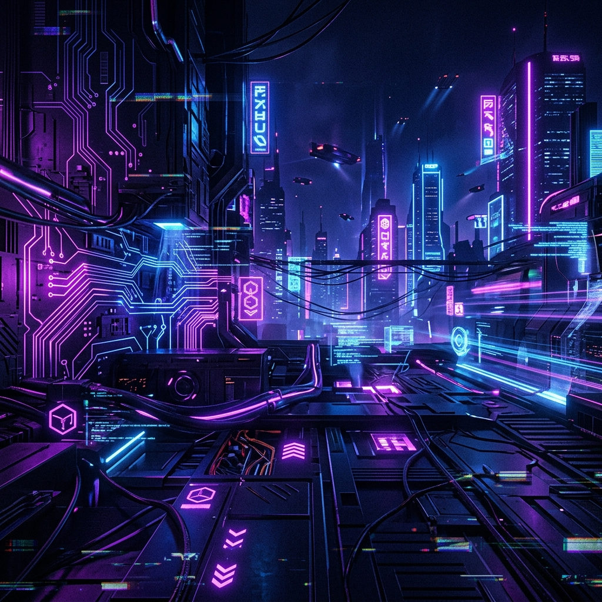

# 
⚡ SYSTEMS ONLINE: EL MEHDI LAHRACH ⚡

  

  

---

### 🌐 INITIALIZING NEURAL LINK...
> **Bio:** Architect of high-performance digital ecosystems. I bridge the gap between low-level efficiency (C) and high-level agility (React/Laravel). Obsessed with code cleanlines, futuristic UI/UX, and scalable architecture. Operating at the intersection of logic and aesthetics.

---

### 🛠️ KERNEL MODULES (SKILLS)

<table align="center">
  <tr>
    <td align="center" width="200"><strong>Frontend Core</strong></td>
    <td align="center" width="200"><strong>Backend Engine</strong></td>
    <td align="center" width="200"><strong>Low-Level & Logic</strong></td>
  </tr>
  <tr>
    <td>
       
       
       
       
      
    </td>
    <td>
       
       
       
       
      
    </td>
    <td>
       
       
       
       
      
    </td>
  </tr>
</table>

---

### 📊 DIAGNOSTICS & METRICS

  
  

  

---

### 🛸 RECENT UPLOADS (PROJECTS)
- 🌦️ **[MétéoConnect](https://github.com/ELMehdi877/meteo)** - Premium weather forecasting system with real-time data visualization.
- 🕌 **ZAD AL-ATQA** - High-end platform for spiritual education and management.
- ⚡ **Digital Identity** - Crafting modern, animated portfolio experiences.

---

### 📡 CONNECTING...
*If you are looking for a developer who speaks 'Future-Proof', I am your signal.*

  

<!-- Last updated: 2026-04-15 -->
